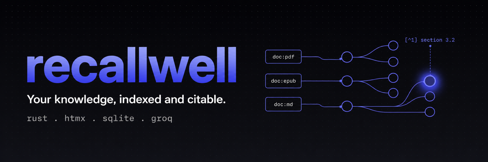
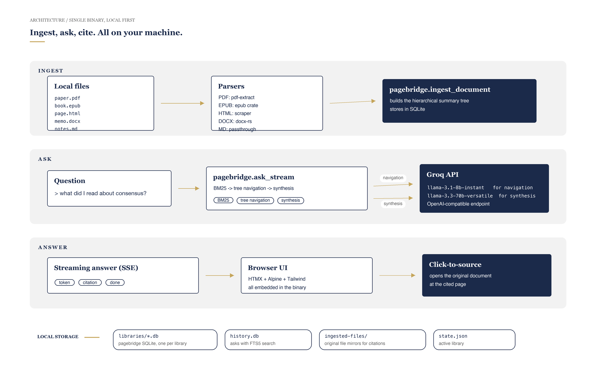

<div align="center">



<br>

[](https://github.com/yasserrmd/recallwell/actions/workflows/ci.yml)
[](https://github.com/yasserrmd/recallwell/actions/workflows/release.yml)
[](#license)
[](https://www.rust-lang.org)
[](#download)

**A personal knowledge base that runs as a single Rust binary on your laptop.**
Drag in your PDFs, EPUBs, HTML, DOCX, and Markdown; ask questions; get answers
with real citations that link back to the original source.

[Download](#download) · [Quickstart](#quickstart) · [How it works](#how-it-works) · [Configuration](docs/CONFIGURATION.md) · [Usage guide](docs/USAGE.md) · [Roadmap](#roadmap)

</div>

---

## Why recallwell

Most "ask my documents" tools either upload your library to a SaaS, give you
weak citations, or expect a subscription. recallwell takes the other path.

|  | recallwell | typical cloud RAG |
|---|---|---|
| Where your documents live | your laptop | their servers |
| Where indexing happens | your laptop | their servers |
| Where history is stored | your laptop | their database |
| What goes to a third party | the question + top excerpts | the entire document |
| Citations | exact section, click-through | usually fuzzy |
| Setup | one binary | account, sub, agent install |
| Cost | free + Groq free tier | monthly |

## Features

- **Multi-format ingest.** PDF, EPUB, HTML, DOCX, Markdown, plain text. All
  parsed locally; nothing leaves your machine.
- **Streaming answers.** Tokens arrive as the model produces them. Citations
  appear inline as they're decided.
- **First-class citations.** Every answer is linked back to a precise section
  of the original document. Click a citation to open the source PDF at the
  right page.
- **Multiple libraries.** "Reading", "work", "recipes" — each is its own
  isolated SQLite database under your data directory.
- **Full-text history.** Every ask is recorded in an SQLite + FTS5 table.
  Re-open old answers without spending another token.
- **Markdown export.** Save any past answer with proper footnoted citations
  for your notes app.
- **One binary, zero setup.** No Node, no Docker, no Python. Download the
  release for your platform, run `setup`, then run the binary.
- **Local-first by design.** Documents, summaries, history, all live in
  plain SQLite + JSON files in your OS-standard data directory. Back up
  with the tools you already use.

## Download

Pre-built binaries are published on the [Releases page](https://github.com/yasserrmd/recallwell/releases/latest):

| Platform | Architecture | Asset |
|---|---|---|
| Linux | x86_64 | `recallwell-vX.Y.Z-x86_64-unknown-linux-gnu.tar.gz` |
| Linux | aarch64 | `recallwell-vX.Y.Z-aarch64-unknown-linux-gnu.tar.gz` |
| macOS | Intel | `recallwell-vX.Y.Z-x86_64-apple-darwin.tar.gz` |
| macOS | Apple silicon | `recallwell-vX.Y.Z-aarch64-apple-darwin.tar.gz` |
| Windows | x86_64 | `recallwell-vX.Y.Z-x86_64-pc-windows-msvc.zip` |

## Quickstart

```bash
# Linux / macOS
curl -L https://github.com/yasserrmd/recallwell/releases/latest/download/recallwell-v0.1.0-x86_64-unknown-linux-gnu.tar.gz \
  | tar xz
./recallwell setup       # one-time, prompts for your Groq API key
./recallwell             # starts the server, opens your browser
```

When the server starts:

```
recallwell v0.1.0
Server running at http://localhost:7676/?t=Kp9X2vRn8mQs7tWfZ3jY4hLc

Browser opening automatically. Bookmark this URL for this session.
Press Ctrl+C to stop.
```

> The `?t=...` token is generated fresh on every server start. Anyone who has
> the URL can use the server, so don't share it.

Get your Groq API key at <https://console.groq.com> (the free tier is plenty
for personal use).

## How it works



Three lanes, all on your machine:

1. **Ingest.** You drop a file into the UI. recallwell parses it with the
   right format-specific library (`pdf-extract`, `epub`, `scraper`, `docx-rs`),
   then hands the text to [pagebridge](https://github.com/YASSERRMD/pagebridge),
   which builds a hierarchical summary tree and stores it in a local SQLite
   file. Progress streams back to the UI as Server-Sent Events.

2. **Ask.** You type a question. Pagebridge does BM25 over the index, then
   uses `llama-3.1-8b-instant` on Groq to navigate the summary tree, picks
   the relevant leaves, and synthesises the final answer with
   `llama-3.3-70b-versatile`. Tokens stream back to the browser as they're
   produced.

3. **Cite.** Every answer is annotated with citations that map back to the
   exact section of the original document. Click a citation to open the
   source PDF at the right page (or HTML / EPUB / DOCX in a new tab).

The only network traffic is the question plus the most relevant excerpts
sent to Groq. The full document text never leaves your machine.

## Keyboard shortcuts

| Shortcut | Action |
|---|---|
| <kbd>Ctrl</kbd>/<kbd>Cmd</kbd>+<kbd>K</kbd> | focus the ask textarea |
| <kbd>Ctrl</kbd>/<kbd>Cmd</kbd>+<kbd>L</kbd> | open the library switcher |
| <kbd>Ctrl</kbd>/<kbd>Cmd</kbd>+<kbd>/</kbd> | show shortcuts help |
| <kbd>Esc</kbd> | close any overlay |

## Configuration

Config lives at the OS-standard location:

| Platform | Path |
|---|---|
| Linux | `~/.config/recallwell/config.toml` |
| macOS | `~/Library/Application Support/com.recallwell.recallwell/config.toml` |
| Windows | `%APPDATA%\com\recallwell\recallwell\config.toml` |

```toml
[groq]
api_key = "gsk_..."
synthesis_model = "llama-3.3-70b-versatile"
navigation_model = "llama-3.1-8b-instant"

[server]
host = "127.0.0.1"
port = 7676
auto_open = true

[ui]
theme = "auto"   # "light", "dark", "auto"

[ingest]
max_concurrent = 2
```

CLI flags (`--data-dir`, `--port`, `--config`) and environment variables
(`RECALLWELL_GROQ_API_KEY`, `RECALLWELL_DATA_DIR`, `RECALLWELL_PORT`) override
the config file.

Full reference: [docs/CONFIGURATION.md](docs/CONFIGURATION.md).

## Privacy

- Documents, indices, summaries, ingested-file mirrors, and history all live
  in your OS-standard data directory.
- Only the question plus the most relevant excerpts go to Groq. The full
  document text is never uploaded.
- The history database (`history.db`) is local SQLite. Delete it any time
  with `rm`.
- recallwell never phones home. No telemetry, no analytics, no crash reports.

## Roadmap

v0.2 priorities, in order:

1. **OCR for scanned PDFs** — Tesseract or vision-LLM fallback. Big unlock
   for older books.
2. **In-app PDF viewer** — embed `pdf.js` so citations scroll to the exact
   paragraph instead of just the page.
3. **Importers** — Kindle "My Clippings", Pocket export, Readwise.
4. **Sync via Syncthing-style file sync** — just sync the SQLite file
   around; no special server.
5. **Browser extension** — one-click web clipping into a chosen library.
6. **Offline mode** — embed llama.cpp so you don't need Groq at all.

## Development

```bash
git clone https://github.com/yasserrmd/recallwell
cd recallwell
cargo run -- setup
cargo run
cargo test
```

Project layout:

```
src/
  config.rs           configuration loading and validation
  cli.rs              clap subcommands
  commands.rs         non-serve subcommand handlers
  library.rs          named libraries backed by pagebridge
  ingest/             per-format parsers and the background queue
    pdf.rs            pdf-extract integration
    epub.rs           epub crate + html-to-markdown
    html.rs           main-content extraction via scraper
    docx.rs           docx-rs paragraph + heading walk
    queue.rs          worker tasks + broadcast for SSE progress
  history.rs          ask history with SQLite + FTS5
  export.rs           answer-to-Markdown rendering
  source.rs           doc-id to original-file mapping
  server/             axum routes, handlers, SSE helpers, token auth
  ui/                 embedded HTML / CSS / JS assets
```

The test suite covers config, CLI, server auth, library management,
parsers, history, source map, and export end-to-end:

```bash
cargo test
# 53 tests across 11 test binaries
```

## Acknowledgments

- [**pagebridge**](https://github.com/YASSERRMD/pagebridge) — the cognitive
  retrieval engine that builds the document tree and answers queries.
- [**Groq**](https://groq.com) — fast LLM inference for navigation and
  synthesis (free tier is generous).
- [**axum**](https://github.com/tokio-rs/axum),
  [**HTMX**](https://htmx.org),
  [**Alpine**](https://alpinejs.dev),
  [**Tailwind**](https://tailwindcss.com) — the rest of the stack.

## License

Dual licensed under [MIT](LICENSE-MIT) or [Apache-2.0](LICENSE-APACHE) at
your option.

---

<div align="center">
<sub>built with care by <a href="https://github.com/yasserrmd">Mohamed Yasser</a></sub>
</div>
